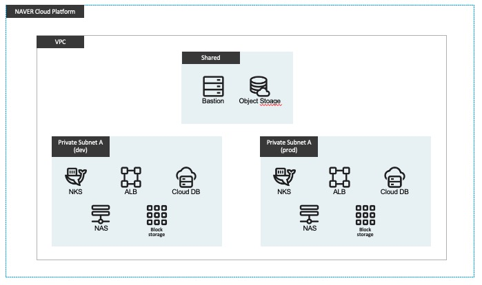
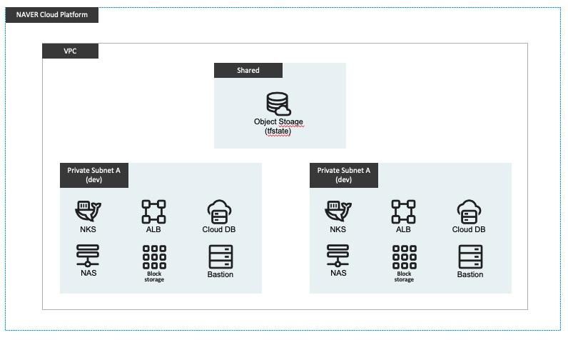
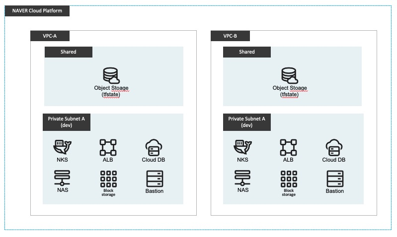

# Terraform / Terragrunt IaC 사용 가이드
<br/>

# 1. 전체 구조 설명

현재 IaC 구조는 **환경(dev / stg / prod)** 과 **공통(shared)** 을
분리해서 관리합니다.

    live
     ├ project
     │   ├ shared
     │   │   ├ network
     │   │   ├ compute
     │   │   └ cert
     │   ├ dev
     │   │   ├ infra
     │   │   ├ platform
     │   ├ stg
     │   └ prod

<br/>

## Layer 개념

### Infra Layer

-   VPC
-   Subnet
-   NAT
-   Route Table
-   Bastion

### Platform Layer

-   NKS
-   Node Pool
-   ACG

### Service Layer

-   DB
-   Object Storage
-   ArgoCD

<br/><br/>

# 2. Shared 구조 설명

Shared 는 여러 환경에서 동일 인프라를 사용할 때 사용합니다.

### Shared 사용하는 대표 케이스

-   dev / prod 가 동일 VPC 사용
-   dev / prod 가 동일 Bastion 사용

<br/>

## Shared 제어 위치

env.hcl 에서 제어

    layers = {
      network = {
        vpc = "shared" or "env"
      }

      compute = {
        bastion = "shared" or "env"
      }
    }

<br/>

# 3. 실제 인프라 생성 방법
## 3-1. VPC + Bastion 같이 사용하는 경우
### env.hcl 설정

    layers = {
      network = {
        vpc = "shared"
      }

      compute = {
        bastion = "shared"
      }
    }

------------------------------------------------------------------------

### 실행 위치

    live/project/shared/network
    live/project/shared/compute

------------------------------------------------------------------------

### 실행 명령어

``` bash
cd live/project/shared/network
terragrunt run --all apply

cd live/project/shared/compute
terragrunt run --all apply
```

------------------------------------------------------------------------

## 3-2. VPC 만 Shared 사용하는 경우

### env.hcl 설정

    layers = {
      network = {
        vpc = "shared"
      }

      compute = {
        bastion = "env"
      }
    }

------------------------------------------------------------------------

### 실행 위치

    live/project/shared/network
    live/project/dev/infra/compute

------------------------------------------------------------------------

### 실행 명령어

``` bash
cd live/project/shared/network
terragrunt run --all apply

cd live/project/dev/infra/compute
terragrunt run --all apply
```

------------------------------------------------------------------------

## 3-3. VPC / Bastion 모두 Shared 안쓰는 경우

### env.hcl 설정

    layers = {
      network = {
        vpc = "env"
      }

      compute = {
        bastion = "env"
      }
    }

------------------------------------------------------------------------

### 실행 위치

    live/project/dev/infra/network
    live/project/dev/infra/compute

------------------------------------------------------------------------

### 실행 명령어

``` bash
cd live/project/dev/infra/network
terragrunt run --all apply

cd live/project/dev/infra/compute
terragrunt run --all apply
```

# 4. 각 Case 샘플 생성
tfstate 관리하는 object storage는 하나의 설정으로 진행한다고 가정 <br/>

## 공통 STEP 0 - Credential 설정 (4-1, 4-2, 4-3 공통 선행)
모든 Case 실행 전에 아래 설정을 먼저 진행

1. object storage 업로드를 위한 aws 설정  
   프로젝트 이름은 `root.hcl`의 `ncloud_profile` 이름이랑 동일하게 설정

    ```bash
    vi ~/.aws/credentials

    [your-project-profile]
    aws_access_key_id = <NCP_IAM_ACCESS_KEY>
    aws_secret_access_key = <NCP_IAM_SECRET_KEY>
    ```


2. ncloud 로컬 환경변수 등록
   `ncp` provider의 경우 profile 지원을 하지 않아 쉘 환경변수 등록이 필요

    ```bash
    # 쉘 단위 환경변수 설정
    export NCLOUD_ACCESS_KEY=<NCP_IAM_ACCESS_KEY>
    export NCLOUD_SECRET_KEY=<NCP_IAM_SECRET_KEY>
    ```

<br/>

## 4-1. VPC, Bastion Shared
<details>
  <summary>설치 명령어 보기</summary>
   <br/>

  ### 프로제트 설정
  - 프로젝트명 : example-ncp-project

  ### root.hcl 파일 수정
  - 실행 경로 : terraform/live/<project>/root.hcl
    ```bash
    project = "example-ncp-project"
    region  = "KR"
    zone    = "KR-1"

    site           = "public"                 # 민간(public), 공공(gov), fin(fin)
    ncloud_profile = "example-ncp-project-dev"     # s3 bucket 설정
    state_bucket   = "example-ncp-project-tfstate" # 이건 수동으로 한번 만들어줘야함

    # VPC를 수정
    vpc_default = {
      name = "tf-test-vpc"
      cidr = "10.30.0.0/16"
    }
    ```

  ### shared env.hcl 파일 수정
  - 실행 경로 : terraform/live/<project>/shared/env.hcl
    ```bash
    project = "example-ncp-project"
    region  = "KR"
    zone    = "KR-1"

    site           = "public"                 # 민간(public), 공공(gov), fin(fin)
    ncloud_profile = "example-ncp-project-dev"     # s3 bucket 설정
    state_bucket   = "example-ncp-project-tfstate" # 이건 수동으로 한번 만들어줘야함

    # VPC를 수정
    vpc_default = {
      name = "tf-test-vpc"
      cidr = "10.30.0.0/16"
    }
    ```

  ### shared network 실행
  - 실행 경로 : terraform/live/<project>/shared/network
    ```bash
    terragrunt run --all apply
    ```

  ### shared bastion 실행
  - 실행 경로 : terraform/live/<project>/shared/network
    ```bash
    terragrunt run --all apply
    ```

</details>


## 4-2. VPC Shared
<details>
  <summary>설치 명령어 보기</summary>
  

</details>

## 4-3. No Shared
<details>
  <summary>설치 명령어 보기</summary>
  
  
</details>


<br/><br/><br/>

# terraform, terragrunt 설치 방법

## mac

``` bash
brew tap hashicorp/tap
brew install hashicorp/tap/terraform
brew install terragrunt
brew install tfenv
```

------------------------------------------------------------------------

## windows

``` bash
choco install terraform -y
choco install terragrunt -y
```

------------------------------------------------------------------------

# 부록

## 자주 사용하는 명령어

``` bash
terragrunt plan
terragrunt run --all apply
terragrunt destroy

find . -name ".terragrunt*" -exec rm -rf {} +
find . -name ".terraform*" -exec rm -rf {} +

terragrunt init -migrate-state
terragrunt init -reconfigure
```
